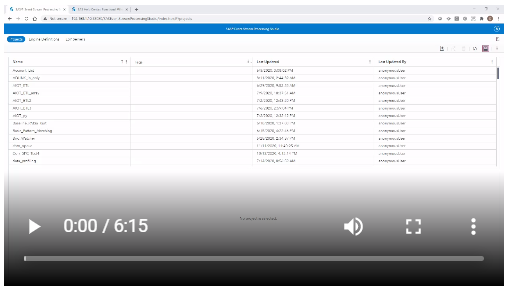
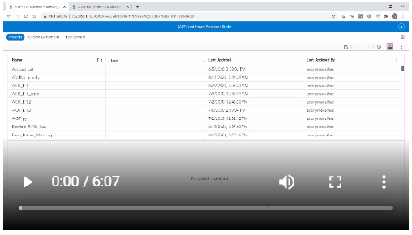
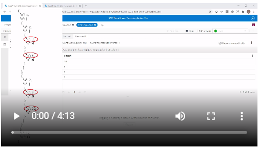
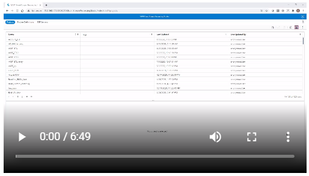

# Functional Window JSON Processing

   

These examples will give the user an understanding of how to use the Functional window to parse and create event loops over JSON objects.

## Overview

The Functional window in ESP is very useful and also not widely understood. There are too many things that can be done with the Functional window to cover in just one repository, so we will just focus on parsing simple JSON objects and processing more complex JSON objects

### Functional Window Basics

Let's start with the name of the window. It is called the Functional window because in it, a collection of functions described in the user guide can be used. It is strongly recommended to have the user guide page with the list of functions open while using the Functional window so that you know what tools are available. You might be surprised at what you find there! 

[Here is a link to that page.](https://documentation.sas.com/?cdcId=espcdc&cdcVersion=v_002&docsetId=espcreatewindows&docsetTarget=p0525asekeyskin1twbpogq2fxbt.htm&locale=en)

Now that we know where to find the functions used in the Functional window, the next topic is where to use them. Looking at the properties panel on the right side of the screen when the Functional window is selected, we are going to focus first on "Function Context" and then on "Event Generation".

#### Function Context

When we expand the "Function Context" tab, we see that we have 3 options: Expressions, Properties, and Functions. We are going to concentrate on Functions in this repo. When you click on the button to create a new function, a box pops up and there are two required elements: Name and Code. The "Name" must correspond exactly to a field in the schema of the Functional window to produce any output. In the "Code" box, the functions from the user guide are used.

#### Function Context Exercise

Before watching the video below, create a file called ex1.in containing this:

```
{"A":"1","B":"2","C":"3","D":"4"}
```

You will need to put this file in a place accessible by the ESP Server.

[](
http://sas-social.brightcovegallery.com/sharing?videoId=6243889265001
 "This video will guide you through the first exercise.")


#### Event Generation

When we expand the Event Generation tab, we see that we have 2 immediate options: 'Use "generate" function' and "Use event loops". When the 'Use "generate" function' box is checked, a box appears in which the user can enter a function or statement that either evaluates to either true or false. If the function or statement evaluates to true, the original event that came into the Functional window will be included with any additional output events created by the Event Generation. If the function or statement evaluates to false, then the original event will not be included along with any output events created by the Event Generation. It is more common that users will not want the original event in addition to any events created by the Event Generation, so a statement like 'false' is entered into the box.

#### Event loops

Checking the "Event loops" box allows us to generate many events from a single event, and that is what we will do in the following exercise. Before watching the video below, create a file called ex2.in containing this, making sure it's all on one line in the file:

```
{"A":1,"B":[{"a":2,"b":[{"c":3,"d":4},{"c":5,"d":6}]},{"a":7,"b":[{"c":8,"d":9},{"c":10,"d":11}]}],"C":12,"D":13}
```

As in the first exercise, you will need to put this file in place accessible by the ESP Server. In the video below, you'll learn how to use event loops in the Functional window to operate on this json object. Throughout the exercise, we will be making small changes to the functional window, one at a time, and see how the output changes.

[](
http://sas-social.brightcovegallery.com/sharing?videoId=6243891524001
 "This video will guide you through part 1 of the second exercise.")
 
[](
http://sas-social.brightcovegallery.com/sharing?videoId=6243890923001
 "This video will guide you through part 2 of the second exercise.")
 

In this next exercise, we will loop through data with a slightly different structure. Create a file called ex3.in containing this:

```
{"readings":[{"value":["1","2","3","4"]}]}
```

In contrast to the previous exercise, in which we wanted one event for each key we choose, this time we want one event for every value corresponding to a specific tag. In the above data, we have a tag called "value" in which there is an array of 4 elements. We would like one output event for every element in the "value" array.

[](
http://sas-social.brightcovegallery.com/sharing?videoId=6243889854001
 "This video will guide you through the third exercise.")


## Conclusion

The Functional window has a wide variety of capabilities, more than can be covered in a single article. This series of exercises should give the user a good understanding of how to use the Function window to process and parse json data.

## Contributing

Please read [CONTRIBUTING.md](CONTRIBUTING.md) for details on how to submit contributions to this project.

## License

This project is licensed under the [Apache 2.0 License](LICENSE.txt).

## Additional Resources

Additional resources might include the following:

* [SAS Analytics for IoT](https://www.sas.com/en_us/software/analytics-iot.html)
* [SAS Event Stream Processing](https://www.sas.com/en_us/software/event-stream-processing.html)
* [SAS for Developers](https://developer.sas.com/home.html)
* [SAS Community Article](https://communities.sas.com/t5/Hacker-s-Hub-library/AIoT-Tutorial-How-to-Process-JSON-Data-in-ESP/ta-p/715692)
